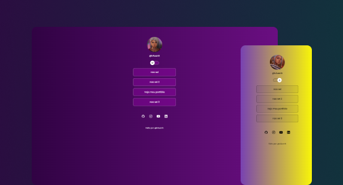

<h1 align="center"> Links </h1>

Projeto para encaminhador de links web  

 

  

## 🚀 Tecnologias

Esse projeto foi desenvolvido com as seguintes tecnologias:

- HTML e CSS
- JavaScript
- Git e Github
- Figma

## 💻 Projeto

Este projeto é um agregador de links para usar como cartão de visitas online.

- [Acesse o projeto finalizado](https://KauanHenriq.github.io/projetolinks)

